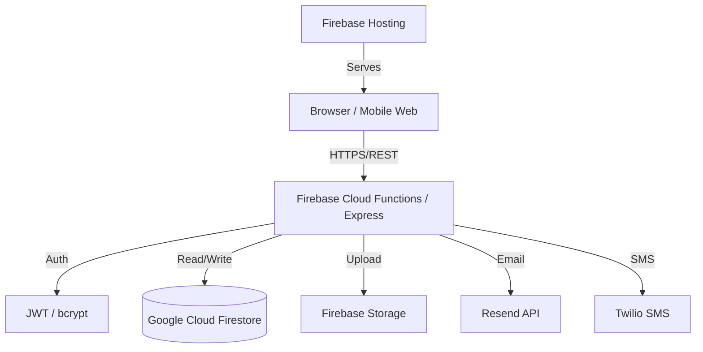
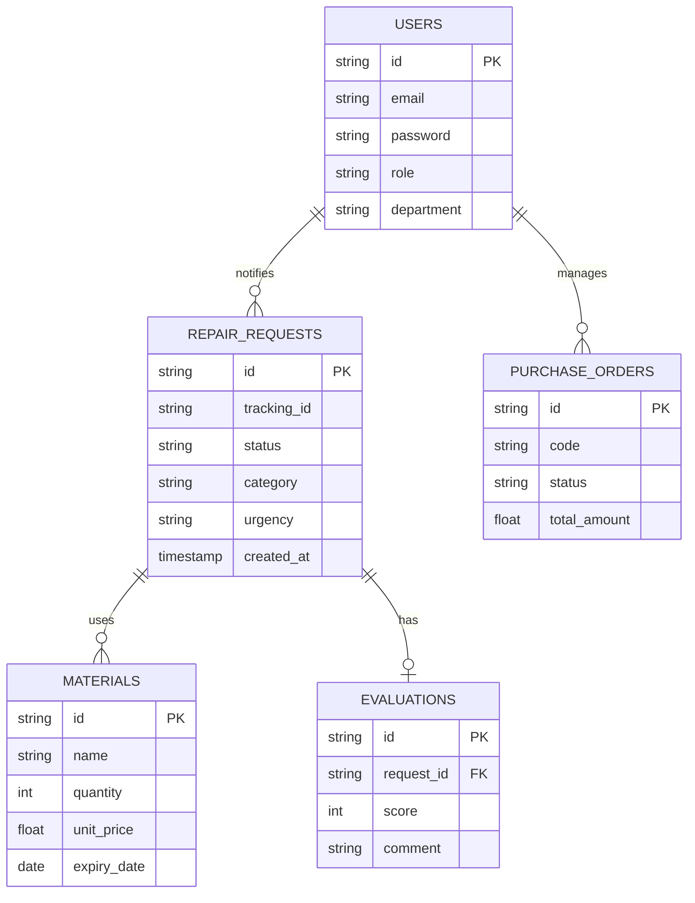
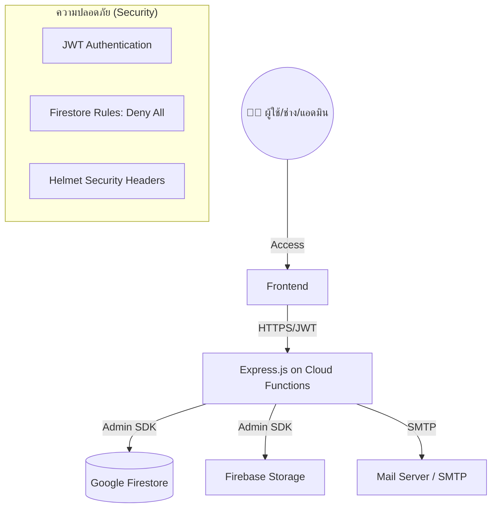

# 🔧 คู่มือระบบแจ้งซ่อมบำรุงในสถานศึกษา (Maintenance Management System)
## โครงการ SDDI - Version 2025 (Master Edition)

ระบบบริหารจัดการงานซ่อมบำรุงสำหรับสถานศึกษาแบบครบวงจร ครอบคลุมตั้งแต่การแจ้งซ่อม, การติดตามสถานะ, การจัดการวัสดุอุปกรณ์, ไปจนถึงการออกรายงานสถิติ เพื่อประสิทธิภาพสูงสุดในการดูแลรักษาสิ่งอำนวยความสะดวก

## 👨‍💻 ผู้พัฒนา
- ทีมงาน SDDI - Maintenance Management System 2025
##  คณะผู้จัดทำ (Project Team)

| รหัสนักศึกษา | ชื่อ-นามสกุล              | ตำแหน่ง                     | 
|---------------|----------------------------|-----------------------------|
| 68030282      | นายศุภโชค หอมสมบัติ       | Development Manager         |
| 68030263      | นายวสุรัชต์ สมเด็จ         | Backend Developer           |
| 68030265      | นายวัฒนพงศ์ พรหมภิราม    | UI/UX Design & Front-End  หน้า Technichain Manager  |
| 68030258      | นางสาววรัทยา รอดเมล์     | UI/UX Design & Front-End  หน้า Admin  |
| 68030262      | นายวศิน แก้วมรกต          | UI/UX Design & Front-End  หน้า login User  |
| 68030271      | นายวีระภัทร อ่วมเกษม      | Quality Assurance (QA)      |
| 68030288      | นายสรวิชญ์ สิทธิรักษ์      | Tester                      |


# เอกสารข้อกำหนดความต้องการซอฟต์แวร์ (SRS)
## ระบบแจ้งซ่อมในสถานศึกษา (Maintenance Management System)
### เวอร์ชัน 2025 (Simplified & Production Ready)

---

### 1.1 วัตถุประสงค์
เอกสารนี้ระบุข้อกำหนดความต้องการของระบบแจ้งซ่อม SDDI เวอร์ชันปี 2025 ซึ่งได้รับการปรับปรุงให้มีความกระชับ (Simplified) ลดความซับซ้อนของขั้นตอนการทำงาน และเน้นความเสถียรในระดับโปรดักชัน (Production Ready) โดยตัดส่วนงานที่มีภาระการบำรุงรากษาสูงออกเพื่อความคล่องตัวขององค์กร

### 1.2 ขอบเขตระบบ (System Scope)
ระบบครอบคลุมวงจรชีวิตการแจ้งซ่อมทั้งหมด ตั้งแต่การแจ้งเหตุ การมอบหมายงาน การดำเนินการซ่อม การจัดการวัสดุอุปกรณ์ และการประเมินผล โดยทำงานบนสถาปัตยกรรม Serverless (Google Firebase)

---

## 2. บทบาทและสิทธิ์ผู้ใช้งาน (User Roles)
ระบบแบ่งผู้ใช้งานออกเป็น 4 บทบาทหลัก:
1.  **ผู้ใช้งาน (User):** แจ้งซ่อมใหม่, ติดตามสถานะ, ประเมินความพึงพอใจ
2.  **ช่างซ่อม (Technician):** รับงาน, บันทึกรูปถ่าย (Before/After), เบิกวัสดุ, อัปเดตสถานะงาน
3.  **ผู้จัดการ (Manager):** มอบหมายงาน, ตรวจสอบรายงาน (Dashboard), จัดการวัสดุและผู้ใช้
4.  **ผู้ดูแลระบบ (Admin):** จัดการสิทธิ์การใช้งาน, ตั้งค่าระบบ SMTP, ตรวจสอบ Audit Logs, และล้างข้อมูลระบบ (Factory Reset)

---

## 3. ความต้องการด้านฟังก์ชันการทำงาน (Functional Requirements)

### 3.1 ระบบจัดการคำขอแจ้งซ่อม (Repair Requests)
- **การแจ้งซ่อม:** ผู้ใช้สามารถระบุประเภทปัญหา (ไฟฟ้า, ประปา, โครงสร้าง ฯลฯ), สถานที่, ความเร่งด่วน, รายละเอียด และแนบรูปภาพได้
- **ความเร่งด่วน (Urgency):** แบ่งเป็น 4 ระดับ (ฉุกเฉิน, เร่งด่วน, ปกติ, ไม่เร่งด่วน) พร้อมการคำนวณ SLA Deadline อัตโนมัติ
- **รหัสติดตามงาน (Tracking ID):** ระบบออกรหัส 6 หลัก (เช่น REQ782) เพื่อใช้ในการติดตามสถานะโดยไม่ต้องเข้าสู่ระบบ (Public Track)
- **รูปภาพหลักฐาน:** รองรับการอัปโหลดรูปภาพ "ก่อนทำ" และ "หลังทำ" เพื่อความโปร่งใสในงานซ่อม

### 3.2 ระบบบริหารจัดการงานและช่าง (Work Management)
- **การมอบหมายงาน (Assignment):**
    - **Manual:** Manager/Admin เลือกช่างเอง
    - **Auto-Assign:** ระบบเลือกช่างที่งานว่างที่สุดให้อัตโนมัติ (เปิด/ปิด ได้ในการตั้งค่า)
- **สถานะงาน (Workflow Status):** รอดำเนินการ -> กำลังดำเนินการ -> รอตรวจสอบ -> เสร็จสมบูรณ์ (หรือ ต้องส่งซ่อมภายนอก)
- **ต้นทุนการซ่อม:** บันทึกค่าใช้จ่ายรายเคสเพื่อใช้ในการสรุปงบประมาณ

### 3.3 ระบบจัดการวัสดุอุปกรณ์ (Material Inventory)
- **ข้อมูลวัสดุ:** บันทึกรหัส SKU, ชื่อ, ยี่ห้อ, หมวดหมู่, หน่วยนับ และราคาต่อหน่วย (Unit Price)
- **การจัดการสต็อก:** ระบบเบิกและตัดสต็อกอัตโนมัติเมื่อช่างบันทึกการใช้ในงานซ่อม
- **ระบบเตือนภัย:** แจ้งเตือนเมื่อวัสดุมีจำนวนต่ำกว่า "จุดสั่งซื้อ" (Reorder Point)

### 3.4 ระบบแจ้งเตือนและการสื่อสาร (Notifications)
- **อีเมลแจ้งเตือน (SMTP):** ส่งอีเมลหาผู้เกี่ยวข้องเมื่อ:
    - มีการแจ้งซ่อมใหม่ (หา Manager/Admin)
    - มีการมอบหมายงาน (หา Technician)
    - งานซ่อมเสร็จสมบูรณ์ (หา User เพื่อประเมิน)
- **ในแอป (In-app):** แสดงจุดแดงแจ้งเตือนใน Dashboard เมื่อมีกิจกรรมใหม่ที่เกี่ยวข้องกับผู้ใช้

### 3.5 ระบบรายงานและผู้บริหาร (Reports & Dashboard)
- **Dashboard:** แสดงสถิติงานซ่อมแยกตามสถานะ, ประเภทงาน, และประสิทธิภาพช่าง (KPI)
- **Export Data:** รองรับการส่งออกข้อมูลเป็น **Excel (.xlsx)**, **CSV** และ **PDF** (Print Mode)
- **Audit Logs:** บันทึกกิจกรรมสำคัญที่เกิดขึ้นในระบบ (ใคร ทำอะไร เมื่อไหร่) เพื่อการตรวจสอบย้อนหลัง

### 3.6 ระบบตั้งค่าและบำรุงรักษา (System Administration)
- **Unified Settings:** รวมศูนย์การจัดการผู้ใช้, สิทธิ์, SMTP Config และ Logs ไว้ในหน้าเดียว
- **Factory Reset:** ฟังก์ชันลบข้อมูลทั้งหมดเพื่อเริ่มระบบใหม่ (จำกัดเฉพาะ Admin)

---

## 4. ความต้องการด้านเทคนิคและความปลอดภัย (Technical & Security)

### 4.1 สถาปัตยกรรม (Architecture)
- **Frontend:** Single Page Application (Vanilla JS / CSS) ไร้ Framework หนัก ๆ เพื่อความเร็ว
- **Backend:** Node.js Express บน Google Cloud Functions (Serverless)
- **Database:** Google Cloud Firestore (NoSQL)
- **Storage:** Firebase Storage สำหรับจัดเก็บรูปภาพงานซ่อม

### 4.2 มาตรการความปลอดภัย
- **Authentication:** ระบบ JWT (JSON Web Token) พร้อมการเข้ารหัสรหัสผ่านด้วย BCrypt
- **HTTP Security:** ติดตั้ง Helmet Middleware ป้องกันช่องโหว่พื้นฐาน (XSS, Clickjacking)
- **Database Security:** ตั้งค่า Firestore Security Rules เป็น "Deny All" (บล็อกการเข้าถึงตรงจาก client)
- **Rate Limiting:** ป้องกันการ Brute-force Login และการเรียก API ซ้ำซ้อน

---

## 5. ส่วนที่ไม่อยู่ในขอบเขต (Out of Scope / Legacy Removed)
เพื่อให้ระบบคงความเสถียรและบำรุงรักษาง่าย ฟังก์ชันต่อไปนี้จึงถูกนำออกจากระบบอย่างเป็นทางการ:
1.  **ระบบใบจัดซื้อ (Purchase Order) และ Supplier Management:** เปลี่ยนเป็นระบบสต็อกพื้นฐาน
2.  **ระบบแจ้งเตือนผ่าน SMS (Twilio):** เปลี่ยนมาใช้อีเมล SMTP เพียงอย่างเดียวเพื่อประหยัดค่าใช้จ่าย
3.  **Resend Email API:** เปลี่ยนมาใช้ SMTP กลางเพื่อความยืดหยุ่นในการตั้งค่าเมลองค์กร
4.  **การทำงานแบบ Offline:** ระบบจำเป็นต้องเชื่อมต่ออินเทอร์เน็ตตลอดเวลา

---

## 6. การยอมรับระบบ (Acceptance Criteria)
ระบบถือว่าสมบูรณ์เมื่อ:
1.  สามารถดำเนินงานซ่อมตามวงจรสถานะจากรอดำเนินการจนถึงเสร็จสมบูรณ์ได้
2.  ระบบสต็อกตัดจำนวนและราคาตามจริง
3.  ระบบส่งอีเมลแจ้งเตือนผ่าน SMTP ที่ตั้งค่าไว้ได้สำเร็จ
4.  การเข้าถึงข้อมูลถูกจำกัดตามสิทธิ์ที่ระบุ (RBAC) 100%


## สรุปการปรับปรุงแก้ไข (Revision History)

| เวอร์ชัน | วันที่       | รายละเอียดการปรับปรุง                                                                
|----------|--------------|-----------------------------------------------------------------------------------------|
| 1.0      | 10 ธ.ค. 68   | ฉบับร่างแรก (Initial Draft)                                                           |
| 2.0      | 17 ธ.ค. 68   | 1. ปรับโครงสร้างเอกสาร: จัดหมวดหมู่ตามมาตรฐาน IEEE 830 เพื่อความเป็นสากล<br>2. เพิ่มรหัสอ้างอิง (Requirement ID): ใส่รหัส REQ-xxx เพื่อให้ง่ายต่อการอ้างอิง<br>3. เพิ่มรายละเอียด Functional: ผนวกรายละเอียดฟิลด์ข้อมูลและเกณฑ์ SLA จากต้นฉบับ<br>4. เพิ่มรายละเอียด Non-Functional: ระบุค่าชี้วัดที่ชัดเจน<br>5. ระบุรายชื่อทีมงาน: เพิ่มส่วนคณะผู้จัดทำ |

## 1. บทนำ (Introduction)

### 1.1 วัตถุประสงค์ (Purpose)
เอกสารนี้จัดทำขึ้นเพื่อระบุข้อกำหนดความต้องการของระบบแจ้งซ่อมอย่างละเอียด เพื่อใช้เป็นแนวทางในการพัฒนาซอฟต์แวร์ ทดสอบระบบ และส่งมอบงาน โดยมุ่งเน้นการแก้ปัญหาความล่าช้าในการแจ้งซ่อม การติดตามสถานะที่ยากลำบาก และการขาดข้อมูลเพื่อการวิเคราะห์และวางแผนบำรุงรักษา

### 1.2 ขอบเขตของซอฟต์แวร์ (Scope)
ระบบแจ้งซ่อม เป็นเว็บแอปพลิเคชัน (Web Application) ที่ครอบคลุมกระบวนการตั้งแต่การแจ้งปัญหา ติดตามสถานะ การมอบหมายงานช่าง การบริหารจัดการวัสดุอุปกรณ์ จนถึงการออกรายงานสรุปผล เพื่อเพิ่มประสิทธิภาพในการบริหารจัดการ

### 1.3 คำจำกัดความและคำย่อ (Definitions and Acronyms)
- **User/Requester:** ผู้ใช้งานทั่วไป ที่เป็นผู้แจ้งซ่อม  
- **Admin:** ผู้ดูแลระบบที่มีสิทธิ์จัดการข้อมูลพื้นฐานและสิทธิ์ผู้ใช้งาน  
- **Technician:** ช่างซ่อมบำรุง  
- **Manager:** หัวหน้างานหรือผู้บริหารที่ดูภาพรวมและรายงาน  
- **SLA (Service Level Agreement):** ข้อตกลงระดับการให้บริการ  

---

## 2. รายละเอียดโดยรวม (Overall Description)

### 2.1 มุมมองผลิตภัณฑ์ (Product Perspective)
ระบบนี้ทำงานเป็นเอกเทศ (Standalone) (ถ้ามี) และรองรับการใช้งานผ่าน Web Browser ทั้งบน Desktop และ Mobile (Responsive Design)

### 2.2 คุณลักษณะของผู้ใช้งาน (User Characteristics)
- **ผู้แจ้งซ่อม (General User):** มีทักษะคอมพิวเตอร์พื้นฐาน ต้องการความสะดวกรวดเร็วในการแจ้ง  
- **ช่างซ่อม (Technician):** เน้นการใช้งานผ่านมือถือหน้างาน ต้องการเห็นข้อมูลงานที่ได้รับมอบหมายชัดเจน  
- **หัวหน้าช่าง/เจ้าหน้าที่ (Staff/Manager):** มีความเข้าใจกระบวนการซ่อมบำรุง ต้องการเครื่องมือในการมอบหมายและติดตามงาน  
- **ผู้ดูแลระบบ (Admin):** มีความรู้ด้านเทคนิค เพื่อแก้ไขปัญหาและจัดการสิทธิ์  

### 2.3 ข้อสมมติฐานและข้อจำกัด (Assumptions and Dependencies)
- ผู้ใช้งานทุกคนต้องมีบัญชีอินเทอร์เน็ตของสถานศึกษา  
- การแจ้งเตือนผ่าน Email อาศัย SMTP Server ของสถานศึกษา  
- รูปภาพที่อัพโหลดต้องมีขนาดไม่เกิน 10MB ต่อรูป  

---

## 3. ความต้องการด้านฟังก์ชัน (Functional Requirements)

### 3.1 โมดูลการแจ้งซ่อม (Repair Request Module)
- **REQ-01:** ระบบต้องสามารถบันทึกข้อมูลการแจ้งซ่อม โดยดึงข้อมูลผู้แจ้งอัตโนมัติ (ชื่อ-สกุล, รหัสประจำตัว, ตำแหน่ง) จากการ Login  
- **REQ-02:** ผู้ใช้ต้องสามารถเลือกประเภทปัญหาได้ โดยระบบมีตัวเลือกดังนี้: ไฟฟ้า, ประปา, โครงสร้าง, อุปกรณ์อิเล็กทรอนิกส์, เครื่องปรับอากาศ  
- **REQ-03:** ผู้ใช้ต้องระบุตำแหน่งที่เกิดเหตุ (อาคาร, ชั้น, ห้อง) ผ่าน Dropdown list เพื่อความถูกต้อง  
- **REQ-04:** ระบบต้องรองรับการอัปโหลดรูปภาพประกอบความเสียหาย (รองรับไฟล์ .JPG, .PNG)  
- **REQ-05:** ระบบต้องกำหนดระดับความเร่งด่วน (SLA) ให้เลือก ดังนี้:  
    - ฉุกเฉิน: ต้องดำเนินการทันที  
    - เร่งด่วน: ภายใน 24 ชั่วโมง  
    - ปกติ: ภายใน 3 วันทำการ  
    - ไม่เร่งด่วน: ภายใน 7 วันทำการ  
- **REQ-06:** เมื่อแจ้งซ่อมสำเร็จ ระบบต้องแสดงหมายเลขติดตามงาน (Tracking ID) และส่งอีเมลยืนยัน  

### 3.2 โมดูลการจัดการงานซ่อม (Job Management Module)
- **REQ-07:** หัวหน้าช่างสามารถกรองรายการแจ้งซ่อมตามความเร่งด่วนและประเภทงาน เพื่อจัดลำดับความสำคัญ  
- **REQ-08:** ระบบต้องแสดงตารางงานปัจจุบันของช่าง เพื่อช่วยในการมอบหมายงาน (Assign) ป้องกันงานซ้อนทับ  
- **REQ-09:** ระบบสามารถแจ้งเตือนช่างผ่านแอปพลิเคชัน/อีเมล เมื่อได้รับมอบหมายงานใหม่  
- **REQ-10:** ช่างซ่อมสามารถบันทึกข้อมูลการดำเนินการผ่านมือถือได้ (เวลาเริ่ม-สิ้นสุด, รายละเอียดการซ่อม, รูปภาพหลังซ่อม)  
- **REQ-11:** สถานะของงานซ่อมต้องประกอบด้วย: รอดำเนินการ, กำลังดำเนินการ, รอตรวจสอบ, เสร็จสมบูรณ์, ต้องส่งซ่อมภายนอก  

### 3.3 โมดูลบริหารจัดการวัสดุ (Inventory Module)
- **REQ-12:** ระบบต้องเก็บข้อมูลวัสดุ (รหัส, ชื่อ, ประเภท, ยี่ห้อ, จำนวนคงเหลือ, ราคาต่อหน่วย, จุดสั่งซื้อ)  
- **REQ-13:** ช่างซ่อมสามารถบันทึกการเบิกใช้วัสดุในแต่ละใบงานซ่อมได้ และระบบจะตัดสต็อกอัตโนมัติ  
- **REQ-14:** ระบบต้องแจ้งเตือน (Low Stock Alert) เมื่อวัสดุลดลงถึงจุด Reorder Point หรือเมื่อวัสดุหมดอายุ  
- **REQ-15:** รองรับการบันทึกการรับเข้าวัสดุใหม่และการตรวจนับสต็อก (Stock Taking)  

### 3.4 โมดูลรายงานและผู้บริหาร (Dashboard & Reporting)
- **REQ-16:** ระบบแสดง Dashboard ภาพรวมสำหรับผู้บริหาร:  
    - กราฟแนวโน้มการแจ้งซ่อมรายเดือน  
    - สัดส่วนประเภทงานซ่อม  
    - พื้นที่ที่มีการแจ้งซ่อมบ่อย  
- **REQ-17:** ระบบสามารถออกรายงานประสิทธิภาพช่าง (ระยะเวลาเฉลี่ยในการปิดงาน, คะแนนความพึงพอใจ)  
- **REQ-18:** ระบบสามารถออกรายงานสรุปการใช้วัสดุและค่าใช้จ่ายในการซ่อมบำรุง  

### 3.5 โมดูลประเมินผล (Evaluation Module)
- **REQ-19:** เมื่อสถานะงานเป็น "เสร็จสมบูรณ์" ระบบต้องเปิดให้ผู้แจ้งซ่อมทำแบบประเมินความพึงพอใจ (คุณภาพ, ความรวดเร็ว, การบริการ)  

---

## 4. ความต้องการที่ไม่ใช่ฟังก์ชัน (Non-Functional Requirements)

### 4.1 ประสิทธิภาพ (Performance)
- รองรับผู้ใช้งานพร้อมกัน (Concurrent Users) ได้ไม่น้อยกว่า 200 คน  
- เวลาตอบสนอง (Response Time) ไม่เกิน 3 วินาที สำหรับการใช้งานทั่วไป  
- ระบบต้องทำงานได้ตลอด 24 ชั่วโมง (Uptime 99.5%)  

### 4.2 ความปลอดภัย (Security)
- รหัสผ่านต้องถูกเข้ารหัส (Encryption) ด้วยมาตรฐาน SHA-256 หรือดีกว่า  
- มีการแบ่งสิทธิ์การเข้าถึงข้อมูล (RBAC) ชัดเจนระหว่าง User, Technician, Admin  
- บันทึก Log การใช้งานและการแก้ไขข้อมูลสำคัญ (Audit Trail)  
- สำรองข้อมูล (Backup) อัตโนมัติทุกวัน  

### 4.3 การใช้งาน (Usability)
- User Interface เป็นภาษาไทย ใช้งานง่าย  
- รองรับ Responsive Design แสดงผลได้ดีบนทั้ง Desktop, Tablet และ Smartphone  

---

## 5. ข้อมูลทางด้านเทคนิค (Technical Overview)

### 5.1 System Architecture 🏗️
ระบบถูกพัฒนาด้วยสถาปัตยกรรม **Serverless** บน Google Cloud Platform (Firebase) เพื่อความรวดเร็วในการขยายตัวและความปลอดภัยสูง



### 5.2 Use Case Diagram 👤
ระบบรองรับ 4 บทบาทหลักที่มีสิทธิ์การใช้งานแตกต่างกัน

```mermaid
useCaseDiagram
    actor "User" as U
    actor "Technician" as T
    actor "Manager" as M
    actor "Admin" as A

    package "ระบบแจ้งซ่อม" {
        usecase "แจ้งซ่อมใหม่ (Submit Request)" as UC1
        usecase "ติดตามสถานะ (Track Status)" as UC2
        usecase "ประเมินความพึงพอใจ (Evaluate)" as UC3
        usecase "อัปเดตงานซ่อม (Fix & Update)" as UC4
        usecase "เบิกวัสดุอุปกรณ์ (Withdraw Materials)" as UC5
        usecase "มอบหมายงาน (Assign Task)" as UC6
        usecase "จัดการใบจัดซื้อ (PO Management)" as UC7
        usecase "ดูรายงานสรุป (Dashboard & Reports)" as UC8
        usecase "จัดการผู้ใช้และสิทธิ์ (User Mgmt)" as UC9
    }

    U --> UC1
    U --> UC2
    U --> UC3
    
    T --> UC4
    T --> UC5
    T --> UC2
    
    M --> UC6
    M --> UC7
    M --> UC8
    
    A --> UC9
    A --> UC8
    A --> UC6
```

### 5.3 Activity Diagram (Repair Workflow) ⚙️
กระบวนการทำงานตั้งแต่เริ่มจนจบงานซ่อม

```mermaid
activityDiagram
    start
    :User: แจ้งซ่อมผ่านระบบ;
    :System: ส่ง Notification หา Manager;
    if (เปิด Auto-Assign?) then (ใช่)
        :System: มอบหมายช่างที่มีงานน้อยที่สุดอัตโนมัติ;
    else (ไม่)
        :Manager: มอบหมายงานให้ช่างด้วยตนเอง;
    endif
    :Technician: รับงานและเริ่มดำเนินการ;
    :Technician: เบิกวัสดุจากคลัง (ถ้ามี);
    :Technician: อัปเดตรูปถ่าย (ก่อน/หลัง) และสถานะ;
    :System: แจ้งเตือน User เมื่อเสร็จสิ้น;
    :User: ประเมินความพึงพอใจ;
    stop
```

### 5.4 ER Diagram (Database Schema) 📊
โครงสร้างข้อมูลบน **NoSQL Firestore**



---

## 6. ประสบการณ์ผู้ใช้ (UX/UI) & การออกแบบ

### 6.1 User Flow
1. **Login:** เลือก Dashboard ตามบทบาท
2. **Action:** แจ้งซ่อม (User) / ทำงาน (Tech) / อนุมัติ (Manager)
3. **Finish:** ปิดงานพร้อมหลักฐานรูปภาพและตัดสต็อกวัสดุอัตโนมัติ

### 6.2 UX/UI Principles
- **Dark Mode Aesthetic:** ใช้โทนสีมืด (Deep Blue & Graphite) เพื่อลดความเมื่อยล้าทางสายตาและดูพรีเมียม
- **Glassmorphism:** ใช้เอฟเฟกต์ความโปร่งใสและ Blur ใน Cards และ Modals
- **Micro-Animations:** มี Feedback เมื่อกดปุ่มหรือเปลี่ยนสถานะ
- **Responsive Web Design:** รองรับ Mobile Web สำหรับช่างที่ต้องทำงานหน้างาน

### 6.3 API Endpoints (Core)
| Method | Endpoint | Description | Auth |
|---|---|---|---|
| POST | `/api/auth/login` | เข้าสู่ระบบ | No |
| POST | `/api/requests` | แจ้งซ่อมใหม่ | User |
| PATCH | `/api/requests/:id/assign` | มอบหมายช่าง | Manager |
| PATCH | `/api/requests/:id/status` | อัปเดตสถานะงาน | Tech |
| GET | `/api/reports/summary` | สรุปข้อมูลสถิติ | Manager |

---

## 6. Stack & Tools ✨

- **Frontend:** HTML5, CSS3 (Vanilla), JavaScript ES6+
- **Backend:** Node.js, Express.js
- **Compute:** Firebase Cloud Functions (v2)
- **Database:** Google Firestore (Serverless NoSQL)
- **Files:** Firebase Storage (Media Evidence)
- **Communication:** Resend (Email), Twilio (SMS Notification)
- **Security:** bcrypt (Password Hashing), JWT (Stateless Auth)
- **Testing:** Newman (Postman CLI), manual test cases

---

## 7. การทดสอบและรายงาน (Testing) 🧪


### 7.1 แผนการทดสอบระบบ (Master Test Cases)
สรุปการทดสอบระบบครอบคลุม Requirement ทั้ง 19 ข้อตามข้อกำหนด (SRS)

| ID | Requirement | รายละเอียดการทดสอบ | Expected Result | Status |
|:---:|:---|:---|:---|:---:|
| **TC_001** | `REQ-01` | ตรวจสอบการดึงข้อมูลผู้แจ้งอัตโนมัติ | แสดงข้อมูล ชื่อ, รหัส, ตำแหน่ง ถูกต้อง | ✅ Pass |
| **TC_002** | `REQ-02` | ตรวจสอบการเลือกประเภทปัญหา | เลือกปัญหาจาก Dropdown ได้ถูกต้อง | ✅ Pass |
| **TC_003** | `REQ-03` | ตรวจสอบระบุตำแหน่งที่เกิดเหตุ | Dropdown อาคาร, ชั้น, ห้อง ทำงานสัมพันธ์กัน | ✅ Pass |
| **TC_004** | `REQ-04` | ตรวจสอบระบบอัปโหลดรูปภาพ | อัปโหลด .JPG, .PNG สำเร็จ และปฏิเสธไฟล์อื่น | ✅ Pass |
| **TC_005** | `REQ-05` | ตรวจสอบการเลือกระดับความเร่งด่วน | เลือกระดับ SLA ได้ครอบคลุมทั้ง 4 ระดับ | ✅ Pass|
| **TC_006** | `REQ-06` | ตรวจสอบ Tracking ID และ Email | สร้างรหัสติดตามและส่งอีเมลหาผู้แจ้งสำเร็จ | ✅ Pass |
| **TC_007** | `REQ-07` | ตรวจสอบการกรองรายการซ่อม | หัวหน้าช่างกรองตามความเร่งด่วน/ประเภทได้ | ✅ Pass |
| **TC_008** | `REQ-08` | ตรวจสอบตารางคิวงานช่าง | แสดงตารางงานเพื่อป้องกันจัดคิวเวลาซ้อนทับ | ✅ Pass |
| **TC_009** | `REQ-09` | ตรวจสอบการแจ้งเตือนงานใหม่ | ช่างได้รับแจ้งเตือนแอป/อีเมลเมื่อมีงานใหม่ | ✅ Pass |
| **TC_010** | `REQ-10` | ตรวจสอบช่างบันทึกข้อมูลผ่านมือถือ | ช่างบันทึกเวลา, รูปหลังซ่อม และรายละเอียดได้ | ✅ Pass |
| **TC_011** | `REQ-11` | ตรวจสอบการเปลี่ยนสถานะงานซ่อม | สถานะเปลี่ยนตาม Workflow ถูกต้องครบถ้วน | ✅ Pass |
| **TC_012** | `REQ-12` | ตรวจสอบการเก็บข้อมูลวัสดุ | บันทึก รหัส, ชื่อ, จำนวน, ราคา ได้ถูกต้อง | ✅ Pass |
| **TC_013** | `REQ-13` | ตรวจสอบเบิกใช้/ตัดสต็อกอัตโนมัติ | ยอดวัสดุลดลงตรงตามจำนวนที่ช่างเบิกใช้ | ✅ Pass |
| **TC_014** | `REQ-14` | ตรวจสอบ Low Stock Alert | มีแจ้งเตือนเมื่อสต็อกลดลงถึงจุดสั่งซื้อ | ✅ Pass |
| **TC_015** | `REQ-15` | ตรวจสอบการรับเข้า / ตรวจนับสต็อก | ยอดสุทธิอัปเดตตรงตามการรับเข้าและตรวจนับ | ✅ Pass |
| **TC_016** | `REQ-16` | ตรวจสอบ Dashboard ผู้บริหาร | แสดงภาพรวมแนวโน้มและสัดส่วนงานถูกต้อง | ✅ Pass |
| **TC_017** | `REQ-17` | ตรวจสอบรายงานประสิทธิภาพช่าง | ออกรายงานเวลาเฉลี่ยปิดงานและความพึงพอใจ | ✅ Pass |
| **TC_018** | `REQ-18` | ตรวจสอบรายงานการใช้วัสดุและเบิกจ่าย | สรุปค่าใช้จ่ายรวมและจำนวนวัสดุได้แม่นยำ | ✅ Pass |
| **TC_019** | `REQ-19` | ตรวจสอบแบบประเมินหลังปิดงาน | ผู้แจ้งทำแบบประเมินได้เมื่อสถานะเสร็จสมบูรณ์ | ✅ Pass |

---
> [!NOTE]
> ระบบนี้ถูกออกแบบมาเพื่อรองรับผู้ใช้พร้อมกันสูงสุด 200 คน (Concurrent) โดยมีการทำ Rate Limiting เพื่อป้องกันการยิง API เกินความจำเป็น

ระบบบริหารจัดการงานซ่อมบำรุงสำหรับสถานศึกษาที่ออกแบบมาเป็น **Serverless Multi-Role SPA** ที่มีความทันสมัย กระชับ และมีประสิทธิภาพสูงสุด เน้นการใช้งานที่ง่าย (Simple) และภาระการบำรุงรักษาต่ำ (Low Maintenance) 

---

## 📂 8. โครงสร้างโครงการ (Project Structure)

โครงการนี้ใช้สถาปัตยกรรม **Monorepo-style** แบ่งส่วนการทำงานออกจากกันอย่างชัดเจน:

- **`/public`**: ส่วนหน้าบ้าน (Frontend) ทั้งหมด
    - `admin.html`, `manager.html`, `technician.html`, `user.html`: หน้า GUI แยกตามบทบาท
    - `index.html`: หน้าล็อกอินหลักและจุดเริ่มต้นของระบบ
    - `style.css`: ไฟล์สไตล์กลาง (Glassmorphism & Neon Design)
    - **`/js`**: ไฟล์ตรรกะเบื้องหลัง (Business Logic)
        - `code.js`: **Core Engine** (จัดการ Navigation, Auth Refresh, UI Helpers)
        - `auth.js`: ระบบยืนยันตัวตนและการเข้าถึง
        - `Requests.js`, `Materials.js`, `Users.js`: ฟังก์ชันจัดการโมดูลต่าง ๆ
        - `Settings.js`: ระบบรวมการจัดการ SMTP, บันทึก Log และสิทธิ์ในหน้าเดียว
- **`/backend`**: ส่วนหลังบ้าน (Node.js API)
    - `index.js`: จุดเชื่อมต่อหลัก (Express + Firebase Functions)
    - **`/routes`**: การกำหนดเส้นทาง API แยกตามบริการ (RESTful Endpoints)
    - **`/services`**: บริการเสริมอิสระ เช่น `NotificationService` (SMTP Email)
    - **`/db`**: การตั้งค่าและการ Seed ข้อมูลเบื้องต้นลง Firestore
- **`/firestore.rules`**: กฎความปลอดภัยสำหรับการเข้าถึงฐานข้อมูลในระดับโปรดักชัน

---

## 🏗️ 9. สถาปัตยกรรมระบบ (System Architecture)

### 9.1 ภาพรวมการทำงาน (System Overview)
ระบบทำงานในรูปแบบ **Cloud-First** โดย Frontend สื่อสารกับ Backend ผ่าน **REST API** และใช้ JWT (JSON Web Token) ในการยืนยันตัวตน



### 9.2 วงจรชีวิตของใบแจ้งซ่อม (Repair Request Lifecycle)
ทุกใบแจ้งซ่อมจะมี Tracking ID หกหลัก (เช่น `REQ782`) และมีสถานะดังนี้:

1.  **รอดำเนินการ (Pending):** เมื่อผู้ใช้ (User) ส่งใบแจ้งซ่อมใหม่ (ระบบส่งเมลหา Manager)
2.  **กำลังดำเนินการ (Ongoing):** เมื่อมีการมอบหมายช่าง หรือช่างกดรับงาน (ช่างอัปเดตรูป "ก่อนทำ")
3.  **รอตรวจสอบ (Review):** เมื่อช่างซ่อมเสร็จและเบิกวัสดุเรียบร้อย (ช่างอัปเดตรูป "หลังทำ")
4.  **เสร็จสมบูรณ์ (Completed):** เมื่อหัวหน้าหรือผู้ใช้ยืนยันการรับงาน (ระบบส่งเมลหา User ให้ประเมิน)

---

## 📊 10. ฐานข้อมูลและสิทธิ์ (Database & RBAC)

### 10.1 โครงสร้างฐานข้อมูล (Firestore Collections)
| Collection | รายละเอียด | ฟิลด์ข้อมูลสำคัญ |
|---|---|---|
| `users` | บัญชีผู้ใช้งาน | `id, name, email, role, department, password (hashed)` |
| `repair_requests` | รายการซ่อม | `tracking_id, title, status, location, urgency, media_paths` |
| `materials` | คลังวัสดุ | `name, quantity, unit, unit_price, reorder_point` |
| `audit_logs` | ประวัติกิจกรรม | `user_id, action, target_id, detail, created_at` |
| `notifications` | การแจ้งเตือนในแอป | `user_id, title, message, is_read` |
| `settings` | การตั้งค่าระบบ | `smtp_host, smtp_port, auto_assign_enabled` |

### 10.2 ตารางสิทธิ์เข้าถึง (RBAC Matrix)
| ฟังก์ชัน | User | Tech | Manager | Admin |
|---|:---:|:---:|:---:|:---:|
| แจ้งซ่อมใหม่ (New Request) | ✅ | – | ✅ | ✅ |
| ติดตามสถานะ (Track Status) | ✅ | ✅ | ✅ | ✅ |
| รับงาน/ซ่อมงาน (Work) | – | ✅ | – | – |
| บริหารจัดการคลัง (Inventory) | – | ✅* | ✅ | ✅ |
| มอบหมายงาน (Assign) | – | – | ✅ | ✅ |
| จัดการผู้ใช้ & ระบบ (Settings) | – | – | ✅ | ✅ |
| ล้างข้อมูลระบบ (Factory Reset) | – | – | – | ✅ |
*\*ช่างทำได้เฉพาะเบิกวัสดุ ไม่สามารถแก้ราคาหรือลบรายการได้*

---

## 🔗 11. เส้นทาง API (API Endpoints Overview)

| Method | Endpoint | รายละเอียด |
|---|---|---|
| POST | `/api/auth/login` | เข้าสู่ระบบ และรับ JWT Token |
| GET | `/api/requests` | ดึงรายการแจ้งซ่อม (กรองตามบทบาทอัตโนมัติ) |
| POST | `/api/requests` | สร้างใบแจ้งซ่อมใหม่ |
| PATCH | `/api/requests/:id` | อัปเดตสถานะ/มอบหมายช่าง/ปิดงาน |
| GET | `/api/materials` | ตรวจสอบรายการวัสดุและสต็อก |
| DELETE| `/api/materials/:id` | ลบวัสดุออกจากคลัง (Admin/Manager) |
| GET | `/api/dashboard/stats` | สรุปข้อมูลเชิงสถิติสำหรับหน้า Dashboard |

---

## 🛡️ 12. ความปลอดภัยและการดูแลรักษา (Security & Maintenance)

### 12.1 ระบบความปลอดภัย
1.  **JWT Authentication:** ข้อมูลผู้ใช้ถูกเข้ารหัสใน Token อายุ 7 วัน
2.  **NoSQL Security:** `firestore.rules` ถูกตั้งค่าเป็น `Deny All` เพื่อบังคับให้เข้าข้อมูลผ่าน API ที่มีการตรวจสอบสิทธิ์เท่านั้น
3.  **HTTPS / Helmet:** ระบบบังคับใช้ HTTPS และมี Security Headers ป้องกันการโจมตีเว็บพื้นฐาน

### 12.2 คู่มือการตั้งค่า SMTP (Email)
เพื่อให้การแจ้งเตือนทำงานได้จริง กรุณาไปที่หน้า **"ตั้งค่าระบบ"** และกรอกข้อมูลดังนี้:
- **Host:** เช่น `smtp.gmail.com`
- **Port:** `465` (SSL) หรือ `587` (TLS)
- **User/Pass:** อีเมลและรหัสผ่านของผู้ส่ง (Gmail ต้องใช้ App Password)

---

## 🚀 13. ขั้นตอนการติดตั้ง (Deployment)

1.  **Firebase Setup:** สร้าง Project ใน Firebase Console และจด Project ID
2.  **Environment:** ในโฟลเดอร์ `backend` ให้ตั้งค่าค่าคงที่ผ่าน Cloud Console เช่น `JWT_SECRET`
3.  **Command:**
    ```bash
    npm install -g firebase-tools
    firebase login
    firebase use --add YOUR_PROJECT_ID
    firebase deploy
    ```

---
> **Master Edition Note:** ระบบนี้ได้รับการปรับปรุงโดยการตัดส่วน PO และ SMS (Twilio/Resend) ออก เพื่อเน้นความเบาและเสถียรที่สุดในการใช้งานในสภาพแวดล้อมจริง


