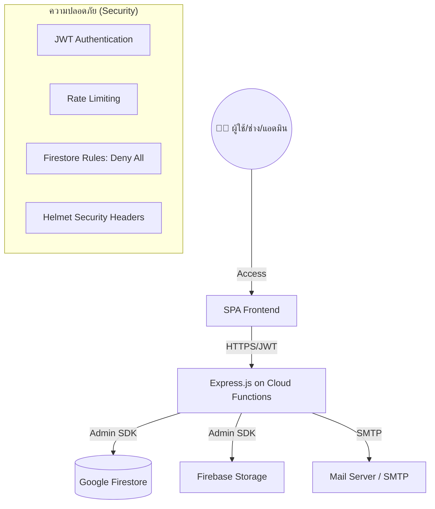

# 🔧 คู่มือระบบแจ้งซ่อมบำรุงในสถานศึกษา (Maintenance Management System)
## โครงการ SDDI - Version 2025 (Master Edition)

ระบบบริหารจัดการงานซ่อมบำรุงสำหรับสถานศึกษาที่ออกแบบมาเป็น **Serverless Multi-Role SPA** ที่มีความทันสมัย กระชับ และมีประสิทธิภาพสูงสุด เน้นการใช้งานที่ง่าย (Simple) และภาระการบำรุงรักษาต่ำ (Low Maintenance) 

---

## 📂 1. โครงสร้างโครงการ (Project Structure)

โครงการนี้ใช้สถาปัตยกรรม **Monorepo-style** แบ่งส่วนการทำงานออกจากกันอย่างชัดเจน:

- **`/public`**: ส่วนหน้าบ้าน (Frontend) ทั้งหมด
    - `admin.html`, `manager.html`, `technician.html`, `user.html`: หน้า GUI แยกตามบทบาท
    - `index.html`: หน้าล็อกอินหลักและจุดเริ่มต้นของระบบ
    - `style.css`: ไฟล์สไตล์กลาง (Glassmorphism & Neon Design)
    - **`/js`**: ไฟล์ตรรกะเบื้องหลัง (Business Logic)
        - `code.js`: **Core Engine** (จัดการ Navigation, Auth Refresh, UI Helpers)
        - `auth.js`: ระบบยืนยันตัวตนและการเข้าถึง
        - `Requests.js`, `Materials.js`, `Users.js`: ฟังก์ชันจัดการโมดูลต่าง ๆ
        - `Settings.js`: ระบบรวมการจัดการ SMTP, บันทึก Log และสิทธิ์ในหน้าเดียว
- **`/backend`**: ส่วนหลังบ้าน (Node.js API)
    - `index.js`: จุดเชื่อมต่อหลัก (Express + Firebase Functions)
    - **`/routes`**: การกำหนดเส้นทาง API แยกตามบริการ (RESTful Endpoints)
    - **`/services`**: บริการเสริมอิสระ เช่น `NotificationService` (SMTP Email)
    - **`/db`**: การตั้งค่าและการ Seed ข้อมูลเบื้องต้นลง Firestore
- **`/firestore.rules`**: กฎความปลอดภัยสำหรับการเข้าถึงฐานข้อมูลในระดับโปรดักชัน

---

## 🏗️ 2. สถาปัตยกรรมระบบ (System Architecture)

### 2.1 ภาพรวมการทำงาน (System Overview)
ระบบทำงานในรูปแบบ **Cloud-First** โดย Frontend สื่อสารกับ Backend ผ่าน **REST API** และใช้ JWT (JSON Web Token) ในการยืนยันตัวตน



### 2.2 วงจรชีวิตของใบแจ้งซ่อม (Repair Request Lifecycle)
ทุกใบแจ้งซ่อมจะมี Tracking ID หกหลัก (เช่น `REQ782`) และมีสถานะดังนี้:

1.  **รอดำเนินการ (Pending):** เมื่อผู้ใช้ (User) ส่งใบแจ้งซ่อมใหม่ (ระบบส่งเมลหา Manager)
2.  **กำลังดำเนินการ (Ongoing):** เมื่อมีการมอบหมายช่าง หรือช่างกดรับงาน (ช่างอัปเดตรูป "ก่อนทำ")
3.  **รอตรวจสอบ (Review):** เมื่อช่างซ่อมเสร็จและเบิกวัสดุเรียบร้อย (ช่างอัปเดตรูป "หลังทำ")
4.  **เสร็จสมบูรณ์ (Completed):** เมื่อหัวหน้าหรือผู้ใช้ยืนยันการรับงาน (ระบบส่งเมลหา User ให้ประเมิน)

---

## 📊 3. ฐานข้อมูลและสิทธิ์ (Database & RBAC)

### 3.1 โครงสร้างฐานข้อมูล (Firestore Collections)
| Collection | รายละเอียด | ฟิลด์ข้อมูลสำคัญ |
|---|---|---|
| `users` | บัญชีผู้ใช้งาน | `id, name, email, role, department, password (hashed)` |
| `repair_requests` | รายการซ่อม | `tracking_id, title, status, location, urgency, media_paths` |
| `materials` | คลังวัสดุ | `name, quantity, unit, unit_price, reorder_point` |
| `audit_logs` | ประวัติกิจกรรม | `user_id, action, target_id, detail, created_at` |
| `notifications` | การแจ้งเตือนในแอป | `user_id, title, message, is_read` |
| `settings` | การตั้งค่าระบบ | `smtp_host, smtp_port, auto_assign_enabled` |

### 3.2 ตารางสิทธิ์เข้าถึง (RBAC Matrix)
| ฟังก์ชัน | User | Tech | Manager | Admin |
|---|:---:|:---:|:---:|:---:|
| แจ้งซ่อมใหม่ (New Request) | ✅ | – | ✅ | ✅ |
| ติดตามสถานะ (Track Status) | ✅ | ✅ | ✅ | ✅ |
| รับงาน/ซ่อมงาน (Work) | – | ✅ | – | – |
| บริหารจัดการคลัง (Inventory) | – | ✅* | ✅ | ✅ |
| มอบหมายงาน (Assign) | – | – | ✅ | ✅ |
| จัดการผู้ใช้ & ระบบ (Settings) | – | – | ✅ | ✅ |
| ล้างข้อมูลระบบ (Factory Reset) | – | – | – | ✅ |
*\*ช่างทำได้เฉพาะเบิกวัสดุ ไม่สามารถแก้ราคาหรือลบรายการได้*

---

## 🔗 4. เส้นทาง API (API Endpoints Overview)

| Method | Endpoint | รายละเอียด |
|---|---|---|
| POST | `/api/auth/login` | เข้าสู่ระบบ และรับ JWT Token |
| GET | `/api/requests` | ดึงรายการแจ้งซ่อม (กรองตามบทบาทอัตโนมัติ) |
| POST | `/api/requests` | สร้างใบแจ้งซ่อมใหม่ |
| PATCH | `/api/requests/:id` | อัปเดตสถานะ/มอบหมายช่าง/ปิดงาน |
| GET | `/api/materials` | ตรวจสอบรายการวัสดุและสต็อก |
| DELETE| `/api/materials/:id` | ลบวัสดุออกจากคลัง (Admin/Manager) |
| GET | `/api/dashboard/stats` | สรุปข้อมูลเชิงสถิติสำหรับหน้า Dashboard |

---

## 🛡️ 5. ความปลอดภัยและการดูแลรักษา (Security & Maintenance)

### 5.1 ระบบความปลอดภัย
1.  **JWT Authentication:** ข้อมูลผู้ใช้ถูกเข้ารหัสใน Token อายุ 7 วัน
2.  **Rate Limiting:** จำกัดการ Login ผิดเกิน 10 ครั้งใน 15 นาที เพื่อป้องกัน Brute-force
3.  **NoSQL Security:** `firestore.rules` ถูกตั้งค่าเป็น `Deny All` เพื่อบังคับให้เข้าข้อมูลผ่าน API ที่มีการตรวจสอบสิทธิ์เท่านั้น
4.  **HTTPS / Helmet:** ระบบบังคับใช้ HTTPS และมี Security Headers ป้องกันการโจมตีเว็บพื้นฐาน

### 5.2 คู่มือการตั้งค่า SMTP (Email)
เพื่อให้การแจ้งเตือนทำงานได้จริง กรุณาไปที่หน้า **"ตั้งค่าระบบ"** และกรอกข้อมูลดังนี้:
- **Host:** เช่น `smtp.gmail.com`
- **Port:** `465` (SSL) หรือ `587` (TLS)
- **User/Pass:** อีเมลและรหัสผ่านของผู้ส่ง (Gmail ต้องใช้ App Password)

---

## 🚀 6. ขั้นตอนการติดตั้ง (Deployment)

1.  **Firebase Setup:** สร้าง Project ใน Firebase Console และจด Project ID
2.  **Environment:** ในโฟลเดอร์ `backend` ให้ตั้งค่าค่าคงที่ผ่าน Cloud Console เช่น `JWT_SECRET`
3.  **Command:**
    ```bash
    npm install -g firebase-tools
    firebase login
    firebase use --add YOUR_PROJECT_ID
    firebase deploy
    ```

---
> **Master Edition Note:** ระบบนี้ได้รับการปรับปรุงโดยการตัดส่วน PO และ SMS (Twilio/Resend) ออก เพื่อเน้นความเบาและเสถียรที่สุดในการใช้งานในสภาพแวดล้อมจริง

## 👨‍💻 ผู้พัฒนา
- ทีมงาน SDDI - Maintenance Management System 2025
